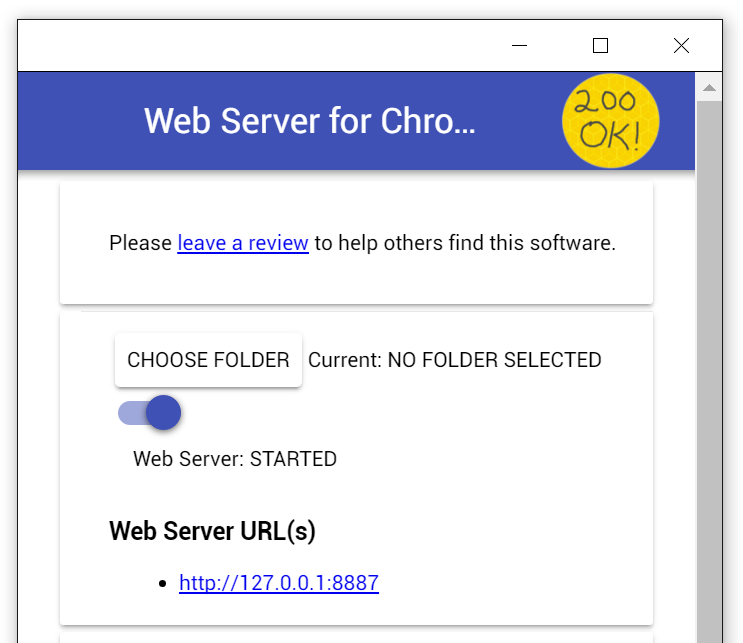

# Progressive Web Apps with Polymer - Devoxx tutorial


*A work-in-progress tutorial for creating a Progressive Web App (PWA) with Polymer, using the Devoxx API as example*

<div style="display: flex; justify-content: center;"><div style="max-width:500px;"></div></div>


I have built this [PWA with Polymer]() tutorial as a quick entry point to coding [Progressive Web Apps]() with [Polymer](https://www.polymer-project.org/). If you want to dive deeper into Polymer, I can suggest my [PolymerBeers](https://github.com/LostInBrittany/polymer-beers) tutorial.

For the last several years, I've taught a web-development module in an Engineering School with a rather restrictive network. As I plan to use this tutorial in next year module, in order to explain PWA and Polymer to our students, I needed a tutorial that could be played without network acces, i.e. without Bower or Gulp or even without [Polymer CLI](https://github.com/Polymer/polymer-cli). So *Progreessive Web Apps with Polymer* needed to be able to be done even behind a very restrictive proxy, and all the dependencies are included inside the git project.


## What are the objectives of this tutorial ##


Follow the tutorial to see how Progressive Web Apps take advantage of new web technologies to act and feel like a native apps. PWAs work for every user regardless of the browser choice, they are reliable, fast and secure. However, building a Progressive Web App from scratch with such requirements can be tedious and complex. As we will see, thanks to Polymer and web components (a set of W3C standards), most of the complex logic can be encapsulated in a component allowing you to build better and faster progressive web apps.

When you finish the tutorial you will be able to use the Polymer App Toolkit to create a Progressive Web App that works in all modern browsers and that offer a nearly native experience on browsers supporting it:

+ Code the application with a component approach, with custom elements
+ Architect your app for instant loading using the App Shell pattern, lazy loading and application fragments
+ Configure the Service Worker to add offline capabilities
+ Write a manifest file to ask the browser to show install banners allowing the user to add the PWA to the home screen
+ Send push notification to the application by using the Web Push API


The tutorial guides you through the entire process of building a simple application. Experiments at the end of each step provide suggestions for you to learn more about PWA, Polymer and the application you are building.

You can go through the whole tutorial in a couple of hours or you may want to spend a pleasant day really digging into it. If you're looking for a shorter introduction to PWA and or Polymer, check out the official website.


## What do I need to use this tutorial?

The two most basic tools needed for this tutorial are a modern web browser (ideally [Chrome]() or [Chromium]()) and a text editor (we suggest the excellent [Visual Studio Code](https://code.visualstudio.com/) or [Atom](https://atom.io))).

Besides them you will need either the [Polymer CLI](https://github.com/Polymer/polymer-cli) or, 	
at a minimal level, a web server to test your code.

### Polymer CLI

Ideally you should install Polymer CLI. Polymer CLI is a *NodeJS* based tool, and it uses *bower*, so you need both of them too:

- To get NodeJS for your platform, go to [the NodeJS site](https://nodejs.org).

- To install bower:

  ```bash
  npm install -g bower
  ```
- To install the Polymer CLI:

  ```bash
  npm install -g polymer-cli
  ```

Then you'll be able to use `polymer`command to create, build and serve your PWA.

### Web server

If you're unable to install the Polymer CLI, you need at least a working web server on your computer. Security policies in the browser make impossible to fully test your JavaScript applications when they have been loaded by opening a local file, they need to be served from a web server.

If you already have a web server (Apache, Nginx, ...) in your computer, you can use it. If not, there are several quick options available:

- Web Server for Chrome: a Chrome/Chromium application that gives you a web server embedded in your browser. You can install it [from the Chrome Web Store](https://chrome.google.com/webstore/detail/web-server-for-chrome/ofhbbkphhbklhfoeikjpcbhemlocgigb?hl=en) .

  After installing the Web Server for Chrome app, click on the Apps shortcut on the bookmarks bar:

  <div style="display: flex; justify-content: center;"><div style="max-width:500px;"></div></div>

  And then on the *Web Server for Chrome* logo to configure the server:


  <div style="display: flex; justify-content: center;"><div style="max-width:500px;"></div></div>

  Now you choose as folder to serve the root of this repository. We also suggest to run it on port 8080. You launch the server and open a browser window navigate to http://localhost:8000/test.html to verify that everything is good

- Using Python: if you have Python in your system, the easiest way would be to run the embedded SimpleHTTPServer. Go to the project directory and run

  ```
  # Python 2.x
  python -m SimpleHTTPServer
  ```

  or

  ```
  # Python 3.x
  python -m http.server
  ```

  to start the web server. Now, open a browser window for the app and navigate to http://localhost:8000/test.html to verify that everything is good.

- If you have [NodeJS](http://nodejs.org) in your system, we have put a minimalist JavaScript web-server on `./scripts/web-server.js`. To see the app running in a browser, open a separate terminal/command line tab or window, go to the project directory and then run `node ./scripts/web-server.js` to start the web server. Now, open a browser window navigate to http://localhost:8000/test.html to verify that everything is good.


## How is the tutorial organized ##

As the computers used for the courses haven't Git, we have structured the project to allow a Git-less use. The `app` directory is the main directory of the project, the working version of the code. The tutorial is divided in steps, each one in its own directory:

1. [Generating and using a pre-made PWA](./step-01/)
1. [Using Polymer CLI to generate an empty PWA](./step-02/)
1. [Calling the DEVOXX API and showing schedule information](./step-03/)
1. [Getting a list of elements from the API and showing it by integrating custom web components](./step-03/)
