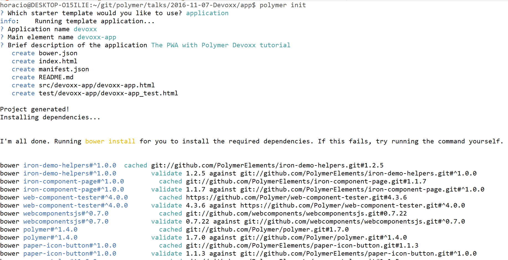
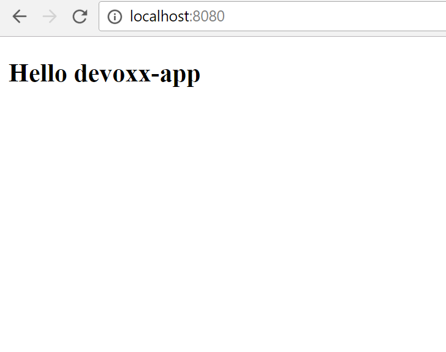

# Step 02 - Using Polymer CLI to generate an empty PWA

After the precedent step, this one is going to be easy: you're going to generate and explore an empty PWA with Polymer.

> As in the precedent case, if you don't have Polymer CLI installed, don't panic. You simple get the `empty-app.zip` resources file and you expand it in the `app` folder.


## Generating the empty app

You're going to use the Polymer CLI to install the PWA sample app: the [Shop app](https://shop.polymer-project.org/).

Go to the `/app` folder and run `polymer init`. Then choose the blank application template, and call your app `devoxx`.

```bash
$ polymer init
```

<div style="display:flex; justify-content:space-around; max-width:100%;"><div style="max-width:500px;"></div></div>

## Explore your app

Now launch `polymer serve` (or your webserver) in order to test the empty application. Point your browser to http://localhost:8080 and you see... a nice empty page.

<div style="display:flex; justify-content:space-around; max-width:100%;"><div style="max-width:500px;"></div></div>

`index.html`
```HTML
<!doctype html>
<html lang="en">
  <head>
    <meta charset="utf-8">
    <meta name="viewport" content="width=device-width, minimum-scale=1, initial-scale=1, user-scalable=yes">

    <title>devoxx</title>
    <meta name="description" content="devoxx description">

    <!-- See https://goo.gl/OOhYW5 -->
    <link rel="manifest" href="/manifest.json">

    <script src="/bower_components/webcomponentsjs/webcomponents-lite.js"></script>

    <link rel="import" href="/src/devoxx-app/devoxx-app.html">
  </head>
  <body>
    <devoxx-app></devoxx-app>
  </body>
</html>
```

As you can see, `index.html` is a simple shell loading web components polyfill and importing your main element, `<devoxx-app>`.
Right now it doesn't do lots of things... but we are going to do something about that right now.

`devoxx-app/devoxx-app.html`
```HTML
<link rel="import" href="../../bower_components/polymer/polymer.html">
<dom-module id="devoxx-app">
  <template>
    <style>
      :host {
        display: block;
      }
    </style>
    <h2>Hello [[prop1]]</h2>
  </template>
  <script>
    Polymer({

      is: 'devoxx-app',

      properties: {
        prop1: {
          type: String,
          value: 'devoxx-app',
        },
      },
    });
  </script>
</dom-module>

```


## Add some routing

Now we are going to add routing to our empty app. We begin by adding `app-route` to your dependencies:

```json
{
  "name": "devoxx",
  "description": "The PWA with Polymer Devoxx tutorial",
  "main": "index.html",
  "dependencies": {
    "polymer": "Polymer/polymer#^1.4.0"
  },
  "devDependencies": {
    "app-route": "PolymerElements/app-route#^0.9.0",
    "iron-component-page": "PolymerElements/iron-component-page#^1.0.0",
    "iron-demo-helpers": "PolymerElements/iron-demo-helpers#^1.0.0",
    "web-component-tester": "^4.0.0",
    "webcomponentsjs": "webcomponents/webcomponentsjs#^0.7.0"
  }
}
```

Ant then making a `bower install` again.

Now we import the `<app-route>` and `<app-location>` elements:

```HTML
<link rel="import" href="../../bower_components/app-route/app-location.html">
<link rel="import" href="../../bower_components/app-route/app-route.html">
```

And then we instantiate them in the template part of the element:

```HTML
<app-location route="{{route}}" use-hash-as-path></app-location>
<app-route route="{{route}}" pattern="/:page" data="{{routeData}}" tail="{{subroute}}"></app-route>
```

Now the field `page` from the `routeData` property will change when the fragment of the URL (the part after the `#`) changes, keeping the value of the first path element in the URL fragment.

As `page` is a subproperty of a property, Polymer 1.x doesn't track its changes (Polymer 2.0 will do it, and you won't need this kind of hack). We are going to declare an explicit observer to track its value, and then, if we have no route, we are going to point the browser to the `#/main` route

```JS
observers: [
  '_routePageChanged(routeData.page)',
],
// *********************************************************************
// Observers
// *********************************************************************

_routePageChanged: function(page) {
  console.debug("[my-devoxx] _routePageChanged", page);
  if (!page) {
    window.history.replaceState({}, null, "#/main");
    window.dispatchEvent(new CustomEvent('location-changed'));
    return;
  }
  this.page = page;
},
```

Now you have a working routing system. We are going to create to * pages* for your app now.
