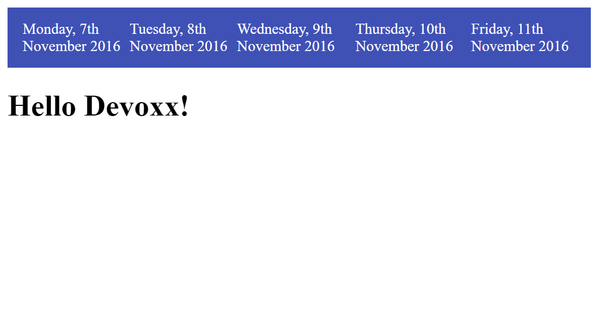

# Step 03 - Calling the DEVOXX API and showing schedule information

In this step we are going to play with the [`<iron-ajax>`](https://elements.polymer-project.org/elements/iron-ajax) element
to call the Devoxx Belgium API.

## The Devoxx API

The Devoxx REST API is described in http://cfp.devoxx.be/api. In this step we are going to call the [Schedules](http://cfp.devoxx.be/api/conferences/DV16/schedules/) endpoint, that will give us back a list of the conference days, and for each day the link to get that day schedule:

API response
```json
{"links": [
  {"href":"http://cfp.devoxx.be/api/conferences/DV16/schedules/monday","rel":"http://cfp.devoxx.be/api/profile/schedule","title":"Monday, 7th November 2016"},
  {"href":"http://cfp.devoxx.be/api/conferences/DV16/schedules/tuesday","rel":"http://cfp.devoxx.be/api/profile/schedule","title":"Tuesday, 8th November 2016"},
  {"href":"http://cfp.devoxx.be/api/conferences/DV16/schedules/wednesday","rel":"http://cfp.devoxx.be/api/profile/schedule","title":"Wednesday, 9th November 2016"},
  {"href":"http://cfp.devoxx.be/api/conferences/DV16/schedules/thursday","rel":"http://cfp.devoxx.be/api/profile/schedule","title":"Thursday, 10th November 2016"},
  {"href":"http://cfp.devoxx.be/api/conferences/DV16/schedules/friday","rel":"http://cfp.devoxx.be/api/profile/schedule","title":"Friday, 11th November 2016"}
  ]}
```

## Making the call

We are going to add an automatic call to the `schedules` endpoint to your `devoxx-main` component. In order to do it, we begin by adding the `<iron-ajax>` dependency and importing it in the element, as we did in the precedent steps.


`bower.json`
```json
"iron-ajax": "PolymerElements/iron-ajax#^1.4.3",
```

`elements/devoxx-main.html`
```HTML
<link rel="import" href="../bower_components/iron-pages/iron-pages.html">
```

And now we do a GET call to the API, and when we will get an answer, we assign the answer to the property `schedules`:

`elements/devoxx-main.html`
```HTML
		<iron-ajax
        id="schedulesRequest"
        url="http://cfp.devoxx.be/api/conferences/DV16/schedules/"
        on-response="_onSchedulesResponse" auto></iron-ajax>
```

Please, take some time to familiarize yourself with the [`<iron-ajax>`](https://elements.polymer-project.org/elements/iron-ajax) API.
As `<iron-ajax>` has an `auto` attribute, it will do a request when it detects any change in its parameters, so an automatic request on instantiation. the `on-response` attribute tells `iron-ajax` what method in your element it must callback when it has a response.

So then we write a `_onSchedulesResponse` on our `devoxx-main` element, where we assign the response to `schedules`:

`elements/devoxx-main.html`
```JS
_onSchedulesResponse: function(evt, ironRequest) {
  this.schedules = ironRequest.response.links;
  console,debug("[devoxx-main] _onSchedulesResponse",this.schedules.links);
}
```

Don´t forget to declare the `schedules` property in order to make Polymer know it:

`elements/devoxx-main.html`:
```HTML
schedules: {
  type: Object,
},
```

## Add a toolbar to choose the days

When want to be able to choose which day do we want to see the program from, so we are going to add a toolbar and fill it with the information received from `schedule`.

We are going to use the `<paper-toolbar>` element, that gives you a nice material design toolbar. LEt's add it to your bower json:

```bash
bower install PolymerElements/paper-toolbar --save
```

And import it in `devoxx-main`:

```HTML
<paper-toolbar justify="around">
</paper-toolbar>
```

Inside we are going to use a [`dom/repeat` template repeater](https://www.polymer-project.org/1.0/docs/devguide/templates#dom-repeat), a helper element that iterates on a variable and create a child element for each item in the iteration. We are iterating on `schedules`:


`elements/devoxx-main.html`:
```html
<paper-toolbar justify="around">
  <template is="dom-repeat" items="[[schedules]]" as="item">
    <div>{{item.title}}</div>
  </template>
</paper-toolbar>
```


<div style="display:flex; justify-content:space-around; max-width:100%;"><div style="max-width:500px;"></div></div>


## Getting the talk list

Now we want to listen to the user input and getting the list of talks for the chosen day.

We begin by adding an event listener to each day in the toolbar:

`elements/devoxx-main.html`:
```html
<paper-toolbar justify="around">
  <template is="dom-repeat" items="[[schedules]]" as="item">
    <div on-tap="_onDayChosen">{{item.title}}</div>
  </template>
</paper-toolbar>
```

And then, we add a function `_onDayChosen` where we get the chosen day:

`elements/devoxx-main.html`:
```js
_onDayChosen: function(evt) {
  var item = evt.model.item;
  console.log("[devoxx-main] _onDayChosen",item);
},
```

Inside a `dom-repeat` the events fired get an additional property, `model`, that gets you the exact instance that generated the event.

So now, we call the API with the chosen day, by using `iron-ajax`, but not in `auto` mode.

`elements/devoxx-main.html`:
```js
_onDayChosen: function(evt) {
  var item = evt.model.item;
  console.log("[devoxx-main] _onDayChosen",item);
  this.$.dayRequest.url = item.href;
  this.$.dayRequest.generateRequest();
},
_onDayScheduleResponse: function(evt, ironRequest) {
    console.debug("[devoxx-main] _onSchedulesResponse",ironRequest.response);
},
```

So no we have as response a list of talk slots. We are going to explore it by showing it on the screen.

We define a `stringify` method:

`elements/devoxx-main.html`:
```js
stringify: function(item) {
  return JSON.stringify(item);
},
});
```

And we use another `dom-repeat` to display each slot:


`elements/devoxx-main.html`:
```html
    <template is="dom-repeat" items="[[slots]]" as="item">
      <div>
        [[stringify(item)]]
      </div>
    </template>
```
